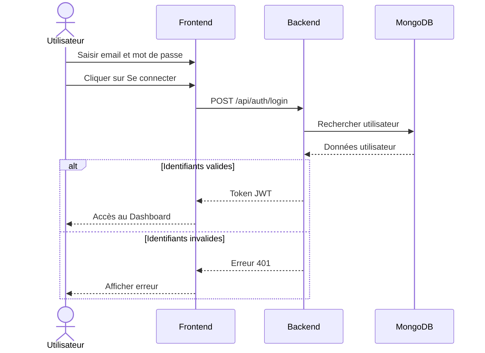

```mermaid
sequenceDiagram
    actor Utilisateur
    participant Frontend
    participant Backend
    participant MongoDB

    Utilisateur->>Frontend: Saisir email et mot de passe
    Utilisateur->>Frontend: Cliquer sur Se connecter
    Frontend->>Backend: POST /api/auth/login
    Backend->>MongoDB: Rechercher utilisateur
    MongoDB-->>Backend: Données utilisateur

    alt Identifiants valides
        Backend-->>Frontend: Token JWT
        Frontend-->>Utilisateur: Accès au Dashboard
    else Identifiants invalides
        Backend-->>Frontend: Erreur 401
        Frontend-->>Utilisateur: Afficher erreur
    end
```